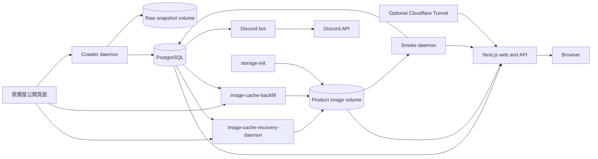

# Architecture

PartsRadarTW 是一個單一 repository 的 TypeScript monorepo。Web、crawler、Discord 與維運程序共用資料庫 contract，但維持各自的 runtime 與程式責任。

## 系統概覽

沒有 queue、event bus、多來源 abstraction 或共用 domain framework。排程程序透過 PostgreSQL 與具名 volume 協調。

Filesystem lock 僅協調同一主機上共享本機 filesystem 或 local named volume 的程序。持有者會定期更新 timed lease，程序異常終止後由 stale timeout 回收；它不提供 NFS／multi-host fencing 保證，若 holder 暫停超過 timeout，恢復時仍可能短暫與 replacement 重疊。

## Workspace 責任

| 區域 | 責任 |
| --- | --- |
| `apps/web` | Next.js 16／React 19 UI、公開 API、站內圖片讀取與瀏覽器配單。 |
| `apps/crawler` | 原價屋 fetch／parser、商品寫入、raw snapshot、ops CLI、smoke 與 Discord bot。 |
| `packages/db` | PostgreSQL 18 的 Prisma schema、migration、seed 與 client。 |
| `packages/shared` | 跨 app 必須一致的原價屋來源身分、公開 URL 與 product facet contract。 |

App-private formatter、UI state、API query、Discord message 與測試 helper 不得移入 `packages/shared`。

## 商品資料流

1. Crawler 從固定的原價屋分類 URL 抓取頁面，限制 timeout、response bytes 與 request 節奏。
2. Content validation 先判斷有效商品頁、無效內容或疑似阻擋；HTTP 200 本身不代表成功。
3. Raw response metadata 寫入 PostgreSQL；HTML 以 content hash 去重後 gzip 保存於 snapshot volume。
4. Parser 驗證商品 token、名稱、價格與圖片 URL。衝突 duplicate 或不可信圖片 URL 會使該分類失敗。
5. 每個分類在 transaction 內更新商品、目前價格指標、價格快照與缺漏計數。
6. Web API 從 PostgreSQL 讀取公開 projection，瀏覽器不直接接觸 crawler 或 raw data。

Fetch、validation 或 parse 失敗不得覆寫最後一份有效商品與價格資料。

## 圖片資料流

1. Parser 只保存符合原價屋 allowlist 的來源圖片 URL。
2. `image-cache-recovery-daemon` 週期性限量補圖；大量修復由 `image-cache-backfill` 手動 service 執行，價格 `crawler-daemon` 不處理或等待圖片下載。
3. 圖片經大小、content type 與 redirect 限制後轉成 WebP，寫入由 `storage-init` 初始化的 product image volume。
4. Web 以 `/api/product-images/{id}.webp` 提供圖片；Web 與 `smoke-daemon` 都以 read-only mount 讀取 volume。

訪客請求期間不會抓取或 hotlink 原價屋圖片。

## 核心資料 invariant

- 目前只支援原價屋，商品身分為 `(sourceCategoryId, ibuyToken)`。
- `source_item_key` 是計算值，不保存於 DB，也不公開。
- 新商品或價格改變時才新增 `price_snapshots`；相同價格只更新 freshness。
- `current_prices` 只指向目前價格快照，不複製價格 truth。
- 商品缺漏與停用計數只在該分類成功觀測後前進。
- Raw snapshot cleanup 不得刪除價格歷史或仍被引用的檔案。
- 金額為整數 TWD；machine timestamps 使用 UTC，使用者畫面轉成 `Asia/Taipei`。
- Source status 代表 crawler／來源資料健康，不代表庫存或可購買狀態。

## Compose topology

| Profile | Services | 用途 |
| --- | --- | --- |
| 無 profile | `postgres`, `storage-init`, `migrate`, `seed`, `web` | 核心服務。 |
| `manual-crawler` | `crawler`, `image-cache-backfill` | 手動 crawl、cleanup 與圖片／vendor backfill。 |
| `scheduled-crawler` | `crawler-daemon`, `image-cache-recovery-daemon`, `raw-snapshot-cleanup-daemon` | 排程抓取、獨立圖片修復與 snapshot 保留。 |
| `ops` | `smoke-daemon` | Web、DB、crawler 與 delivery 健康檢查。 |
| `discord-bot` | `discord-bot` | Slash commands 與通知排程。 |
| `public-tunnel` | `cloudflared` | 選用 public ingress。 |

## Storage ownership

| Volume | Read/write owners | Read-only owners |
| --- | --- | --- |
| `postgres_data` | `postgres` | 無 |
| `snapshots` | `storage-init`, `crawler`, `crawler-daemon`, cleanup daemon, `smoke-daemon` | 無 |
| `product_images` | `storage-init`, `image-cache-recovery-daemon`, `image-cache-backfill` | `web`, `smoke-daemon` |

`crawler` 手動 service 不掛載 product image volume；手動圖片補圖必須使用 `image-cache-backfill`。

## Source of truth

- DB tables and enums: `packages/db/prisma/schema.prisma`
- SQL views and schema history: `packages/db/prisma/migrations/`
- Public routes: `apps/web/app/api/**/route.ts`
- Parser and source rules: `apps/crawler/src/coolpc/`
- Runtime topology: `compose.yml` and `compose.*.yml`
- Runtime configuration template: `.env.example`
- Shared package boundary: `packages/shared/README.md`

維運與部署步驟分別見 [operations.md](operations.md) 與 [deployment.md](deployment.md)。
